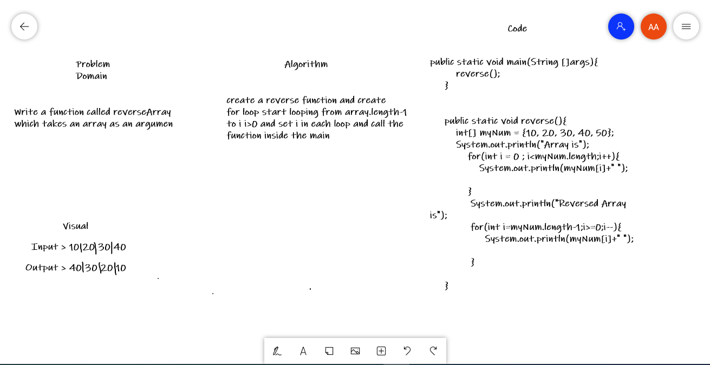

# code challenge 1

# Reverse an Array
*Write a function called reverseArray which takes an array as an argument*

## Whiteboard Process

### Approach & Efficiency
create a reverse function and create for loop to looping on array