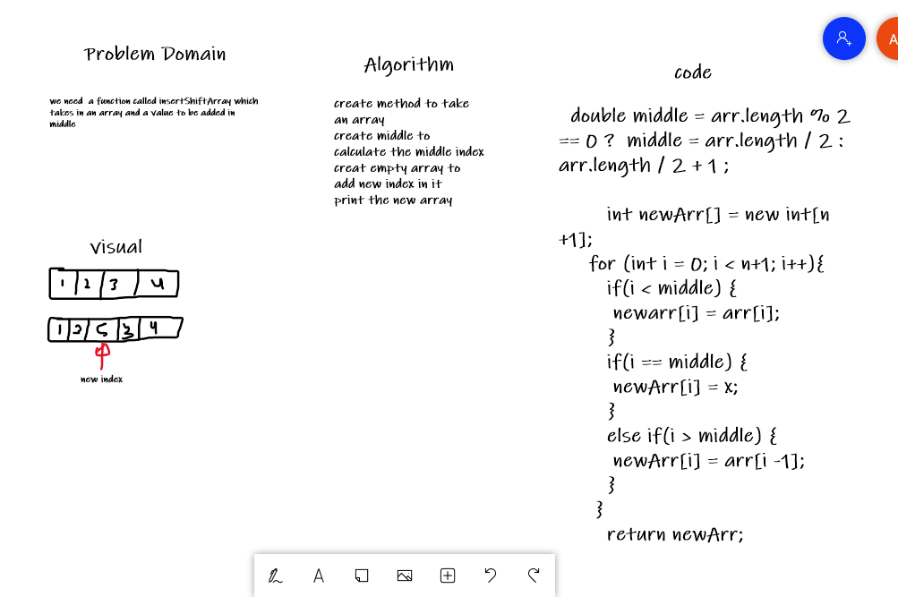

# Code challenge 2

# Insert to Middle of an Array
 we need  a function called insertShiftArray which takes in an array and a value to be added in middle.

## Whiteboard Process

## Approach & Efficiency
I used Array with if statement to declare new index